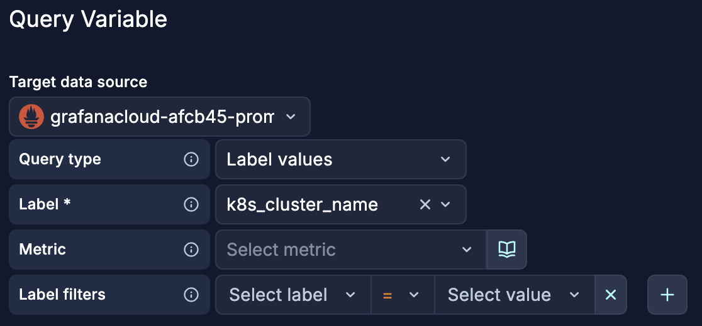
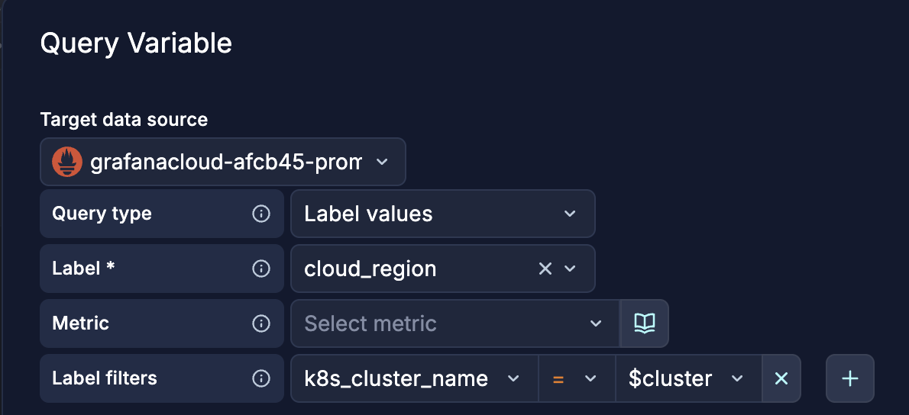
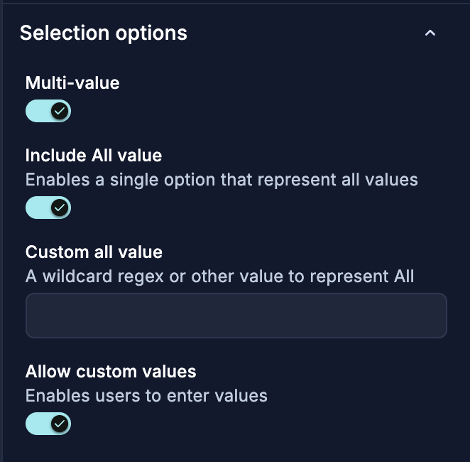

# GrafanaCON 2026 — Advanced Dashboarding Lab: Exercises

> You're the SRE on-call for **Grot Plushies**, a microservices e-commerce platform. An alert just fired. You open Grafana to investigate. Over the course of this lab you will build — from scratch — the very dashboard you'd want in that moment.
>
> The platform runs five services:
>
> - **Frontend** : the user-facing storefront
> - **CartService** : manages shopping carts (backed by Redis + Postgres)
> - **CheckoutService** : orchestrates order placement (backed by Postgres)
> - **PaymentService** : processes payments
> - **ProductCatalog** : serves product listings
>
> **Data sources available in your instance:**
>
> - `grafanacloud-<instance>-prom` — Prometheus (span metrics, SLO metrics, Postgres metrics)
> - `grafanacloud-<instance>-logs` — Loki (service logs, feature flag events)
> see [metrics-schema.md](/metrics-schema.md) for details about the metrics

---

## Task 1 — Set Up the Dashboard Layout

**Goal:** Create the structural skeleton of the dashboard: four tabs, a few basic panels, and an auto-grid layout.

**Features practised:** Tabs, layout groups, auto layout

### Steps

1. **Create a new dashboard**
  - Click **Dashboards → New → New dashboard**.
  - [*alt*] or use the `+` button in the top nav bar

2. **Add your first tab — "Fleet Overview"**
   - In the side toolbar, click **Add** → Group layout > **Tab**.
   - Name it **Fleet Overview**.

3. **Add three more tabs**
  - Click the **+ New tab** button to the right of the existing tab.
  - Name them :
    -  **Logs**
    -  **Service Deep Dive**
    -  **Business Metrics**
    -  **Bug Reports & Support Escalations**

4. **Add starter panels to Fleet Overview**
  - On the **Fleet Overview** tab
  - Click **+ Add panel** 
  - Click **Configure** 
    - Data source: `grafanacloud-<...>-prom`
    - Query A — Total RPS across all services:
      ```promql
      sum(rate(traces_spanmetrics_calls_total{k8s_namespace_name="ditl-demo-prod"}[$__rate_interval]))
      ```
    - Set visualization to **Stat**. Title: **Total RPS**.
  - Repeat for **Error rate**:
    - Query:
      ```promql
      sum(rate(traces_spanmetrics_calls_total{k8s_namespace_name="ditl-demo-prod", status_code="STATUS_CODE_ERROR"}[$__rate_interval]))
      /
      sum(rate(traces_spanmetrics_calls_total{k8s_namespace_name="ditl-demo-prod"}[$__rate_interval]))
      ```
    - Title: **Error Rate**. 
    - Visualisation **Stat**. Unit: `Percent (0.0-1.0)`.
  - Repeat for **P95 Latency** panel:
    ```promql
    histogram_quantile(0.95,
      sum by (le) (
        rate(traces_spanmetrics_latency_bucket{}[$__rate_interval])
      )
    )
    ```
  - Set the unit to **seconds** and visualization to **Stat**.

5. **Enable auto layout**
  - With the tab selected, change the **Layout** options in the panel-editing sidebar.
    - Choose **Auto layout**. Watch your panels snap into an evenly distributed row.

6. **Add a panel to Logs**
  - On the **Logs** tab
  - Click **+ Add panel** 
  - Click **Configure** 
    - Data source: `grafanacloud-<...>-logs`
    - Query A :
      ```logql
      {k8s_namespace_name="ditl-demo-prod"}
      ```
    - Set line limit as `100` in query options
    - Enable **Show timestamps** in Logs panel options
    - Set visualization to **Logs**. Title: **Most recent logs**.

7. **Save the dashboard** as **Grot Plushies Monitoring Dashboard**.

> **Checkpoint:** You should have a saved dashboard with 4 tabs. The Fleet Overview tab has 3 panels in an auto layout. The Logs tab has 1 panel.

---

## Task 2 — Make the Dashboard Interactive with Variables

**Goal:** Add template variables so every panel can be filtered by cluster, namespace, and service with a single selection.

**Features practised:** Query variables, custom variables, variable chaining

### Steps

1. To add a variable, click the **Add new element** button → Dashboard controls > **Variable** → select a type for it.

2. **Add the `cluster` variable**
  - **Name:** `cluster`. **Type:** Query
  - Click **Open variable editor**
  
  - Click **Preview** then **Close**.

3. **Add the `region` variable**
  - **Name:** `region`. **Type:** Query
  - Click **Open variable editor**
  
  - Click **Preview** then **Close**.

4. **Add the `service` variable**
  - **Name:** `service`. **Type:** Query
  
  - **Stream selector:** `{cluster="$cluster", namespace="$namespace"}`
  - Click **Preview** then **Close**.
  - **Multi-value:** On
  
  
5. **Add the `show_business_metrics` variable (toggle)**
  - **Name:** `show_business_metrics`
  - **Type:** Switch
  - **Values:** `true,false`
  - **Label:** Include business metrics
  - Click **Apply**.

6. **Wire up your panels**
  - In the **Fleet Overview** tab.
    - Edit the queries with:
      ```promql
      {cloud_region="$region",k8s_cluster_name="$cluster"}
      ```
  - In the **Logs** tab, logs panel,
    - Edit the logs query with:
      ``` logql
      {container=~"$service", cluster="$cluster", cloud_region=~"$region"}
      ```
    - Notice how the logs get filtered
    - In the panel repeat options
      - select **service** variable
    - Rename the panel **Most recent logs - $service**

7. **Test the variables**
  - Use the dropdowns at the top to change `cluster`, `namespace`, and `service`.
  - Verify the panels update accordingly.

8. **Save.** the dashboard

> **Checkpoint:** Your dashboard has 4 variables in the top bar. Changing cluster or namespace filters all three stat panels on Tab 1 and changing service repeats the logs panel in Logs tab.

---


## Task 3 — Filters and Conditional Panels

**Goal:** Replace hard-coded query variables with ad-hoc filters, add show/hide rules, and reorganise variables by section.

**Features practised:** Ad-hoc filters, show/hide rules, section-level variables

### Part A — Ad-hoc Filters

1. **Add an ad-hoc filter variable**
  - Go to **Dashboard settings → Variables → Add variable**.
  - **Type:** Ad Hoc Filters
  - **Data source:** `grafanacloud-prom`
  - Click **Apply**.

2. In the **Fleet Overview** tab.
  - Group all 3 panels into a **row** and call it **From variables**
  - Duplicate the row, call it **Filters only** 
    - remove all the references to template variables in their queries
  - Select a single value for the cluster & region query variables.
    - Notice how the 2 rows do not show the same numbers. 
  - Now set up the new filter variable to reflect what you selected in the query variables.
    - Notice how now the data is the same

3. **Use filters only**
  - Remove the 2 query variables for cluster & region
  - Delete the row that references them
  - To tidy up, you can also use **Ungroup rows** to remove the single row in your tab.


### Part B — Show/Hide Rules

1. **Add a show/hide rule for the Business Metrics tab**
  - Select the **Business Metrics** tab.
  - Add a show/hide rule:
    - **Variable:** `include_business`
    - **Operator:** `equals`
    - **Value:** `true`
  - The entire tab is now hidden unless the toggle is on.
2. **Test your rules**

  - Toggle `include_business` off → the Business Metrics tab should hide.

### Part C — Section-Level Variables

1. **Move `service` to the Logs tab**
  - It's only used there - let's declutter the top level

2. **Add `time_window` as a section variable on Business Metrics**
  - **Name:** `time_window`
  - **Type:** Custom
  - **Values:** `1h,6h,1d`

3. **Save.** the dashboard

> **Checkpoint:** Filters apply dashboard-wide and replace query variables. A business tab is shown unless we toggle a switch variable, some tabs have section level variables.

---

## Task 4 — Field Overrides

**Goal:** Make panels visually self-explanatory by styling individual series differently.

**Features practised:** Field overrides by name, by regex, colour and line style

There are 2 exercises in that section, you can do both or pick one of them.

### Part A — Orders vs Sessions (Business Metrics)

1. **Navigate to Tab 3 — Business Metrics**
   - Make sure `include_business` is set to `true` so the tab is visible.

2. **Create the panel**
   - Add a new panel. Title: **Orders vs Sessions**.
   - Visualization: **Time series**.
   - **Query A — Orders:** Loki
     ```logql
     sum(count_over_time({job=~"ditl-demo-prod/checkoutservice.+"} |= "order placed successfully"[$__range]))
     ```
     - Options Legend: `Orders`
   - **Query B — Sessions:** Prometheus
     ```promql
     sum(UniqueSessionCount{action_name="view-products"})
     ```
     - Options Legend: `Sessions`

  

3. **Add field overrides to differentiate the two series**
   - Go to the **Overrides** tab in the panel editor.
   - **Override 1 — Orders (Query A):**
     - **Match:** Fields returned by query **A**
     - **Color:** Green (`#73BF69`)
     - **Line style:** Solid
     - **Axis:** Left Y
   - **Override 2 — Sessions (Query B):**
     - **Match:** Fields returned by query **B**
     - **Color:** Purple (`#8F3BB8`)
     - **Line style:** Dashed
     - **Axis placement:** Right Y
   - Click **Apply**.

4. **Verify**
   - You should see two series on the same chart: Orders as a solid green line on the left axis, Sessions as a dashed purple line on the right axis.
   - The dual-axis layout lets you compare trends even when the absolute values are on different scales.

### Part B — HTTP status code

1. On the **Service Deep Dive** tab, add a new panel:
   - Data source: `grafanacloud-prom`
   - **Query** :
     ```promql
     sum by (http_status_code) (rate(traces_spanmetrics_calls_total{}[$__rate_interval]))
     )
     ```
   - Visualization: **Time series** or **Bar chart**.
   - Title: `HTTP Status Code`.

2. Open the **Overrides** section in the panel options.

3. **Override 1 — make 2xx green:**
   - Click **Add field override** → **Fields with name matching regex**: `2[0-9][0-9]`
   - Add property: **Standard options > Color scheme** → **Fixed color** → Green.

4. **Override 2 — make 4xx orange:**
   - Click **Add field override** → **Fields with name matching regex**: `4[0-9][0-9]`
   - Add property: **Standard options > Color scheme** → **Fixed color** → Orange.

4. **Override 2 — make 5xx red:**
   - Click **Add field override** → **Fields with name matching regex**: `5[0-9][0-9]`
   - Add property: **Standard options > Color scheme** → **Fixed color** → Red.

6. **Save** the panel. 

> **Checkpoint:** Confirm that 2xx bars/lines are green and 5xx are red in the visualization.

---

## Task 5 — Data Links

**Goal:** Wire panels together so clicking a data point takes you to the right context instantly.

**Features practised:** Field data links, dynamic link variables

### Part A — Slow Spans Table → Loki Logs

1. **Create the "Top 10 Slowest Spans" table on Tab 2**
  - Add a new panel. Title: **Top 10 Slowest Spans**.
  - Visualization: **Table**.
  - Query (Prometheus, instant):
    ```promql
    topk(10,
      histogram_quantile(0.95,
        sum by (span_name, le) (
          rate(traces_spanmetrics_latency_bucket{
            service_name="$service_name",
            k8s_namespace_name="$namespace"
          }[2m])
        )
      )
    )
    ```
2. **Add a data link to Loki logs**
  - In the panel editor, go to the **span_name** field overrides (or the panel-level data links).
  - Click **Add data link**.
  - **Title:** `View logs`
  - **URL:**
    ```
    /explore?left={"datasource":"grafanacloud-logs","queries":[{"expr":"{namespace=\"$namespace\", service_name=\"$service_name\", span_name=\"${__data.fields.span_name}\"}"}],"range":{"from":"${__from}","to":"${__to}"}}
    ```
  - Alternatively, use the simpler Explore URL format your Grafana version supports.
  - **Open in:** New tab
3. **Test it**
  - Select a service, then click a row in the table.
  - It should open Explore with Loki pre-filtered to that service + span + time range.

### Part B — Service Card → Tab 2

1. **Add a data link to each repeated service group (Fleet Overview)**
  - Go back to the **Fleet Overview** tab.
  - Edit one of the panels inside the repeated service group.
  - Add a **data link**:
    - **Title:** `Deep dive →`
    - **URL:**
      ```
      /d/<dashboard-uid>/grot-plushies-sre?tab=service-deep-dive&var-service_name=${__field.labels.service_name}
      ```
      (Replace `<dashboard-uid>` with your actual dashboard UID — find it in the URL bar.)
    - **Open in:** Same tab (to navigate within the same dashboard)

### Part C — Slow Spans → Tab 4 (DB services only)

1. **Add a secondary data link on the slow spans table**
  - Back on the **Top 10 Slowest Spans** panel (Tab 2).
  - Add a second data link:
    - **Title:** `Investigate database →`
    - **URL:**
      ```
      /d/<dashboard-uid>/grot-plushies-sre?tab=database&var-service_name=${__data.fields.service_name}
      ```
  - This link is useful when the selected service is `cartservice` or `checkoutservice`.
2. **Save.**

> **Checkpoint:** Clicking a span name in the table opens Loki logs. Clicking a service card navigates to Tab 2. A second link on slow spans leads to Tab 4 for DB-backed services.

---

## Task 6 — Saved Queries

**Goal:** Extract a commonly-used query into the shared query library so anyone on the team can reuse it.

**Features practised:** Saved queries, query library

### Steps

1. **Identify the query to save**
  - You've been using the **p95 latency** query in multiple panels (Fleet Overview stat and Tab 2 timeseries):
2. **Save it to the query library**
  - Open any panel that uses this query (e.g. the P95 Latency stat on Tab 1).
  - In the query editor, click the **three-dot menu** (⋮) next to the query → **Save to query library**.
  - **Name:** `p95 Latency — All Services`
  - **Description:** `95th percentile latency across all services in the selected namespace. Uses traces_spanmetrics_latency_bucket.`
  - Click **Save**.
3. **Reuse the saved query in a new panel**
  - Go to **Tab 2 (Service Deep Dive)**.
  - Add a new panel or edit an existing one.
  - In the query editor, click **Saved queries** (or the library icon).
  - Find **p95 Latency — All Services** and select it.
  - The query is inserted automatically with the correct datasource and PromQL.
4. **Verify**
  - Both panels (the one on Tab 1 and the new one on Tab 2) now share the same underlying query definition.
  - If the metric name ever changes, you update it once in the library.
5. **Save.**

> **Checkpoint:** The p95 latency query lives in the shared library. Any teammate building a new panel can find and reuse it.

---

## Task 7 — SQL Expressions

**Goal:** Use SQL Expressions to combine data from multiple queries into a single table — no extra transformations needed.

**Features practised:** SQL Expression transformation, cross-query JOINs

### Part A — Service Risk Ranking Table (Tab 3)

1. **Navigate to Tab 3 — Business Metrics** (make sure `include_business` is set to `true`).
2. **Add a new panel**
  - Title: **Service Risk Ranking**
  - Visualization: **Table**
3. **Add Query A — p95 latency per service (instant)**
  ```promql
   histogram_quantile(0.95,
     sum by (service_name, le) (
       rate(traces_spanmetrics_latency_bucket{k8s_namespace_name="$namespace"}[2m])
     )
   )
  ```
  - Set the query to **Instant** (not range).
  - Set the legend / ref ID to **A**.
4. **Add Query B — error budget burn rate per service (instant)**
  ```promql
   (1 - grafana_slo_success_rate_5m) / (1 - 0.999)
  ```
  - Set the query to **Instant**.
  - Set the legend / ref ID to **B**.
5. **Add a SQL Expression transformation**
  - Go to the **Transform** tab.
  - Click **Add transformation → SQL Expression**.
  - Enter the following SQL:
    ```sql
    SELECT
      A.service_name,
      A.Value AS p95_latency,
      B.Value AS burn_rate,
      A.Value * B.Value AS risk_score
    FROM A
    JOIN B ON A.service_name = B.service_name
    ORDER BY risk_score DESC
    ```
6. **Style the table**
  - Add a field override on `risk_score`:
    - **Color mode:** Continuous (green → yellow → red)
    - **Thresholds:** green < 1, yellow 1–5, red > 5
7. **Save.**

### Part B — Rolling Average Time Series

1. **Add a new panel on Tab 3 (or Tab 2)**
  - Title: **CPU Usage — Rolling Average**
  - Visualization: **Time series**
2. **Add a base query**
  - Use your CPU metric query as Query A (range query).
3. **Add a SQL Expression transformation**
  - ```sql
    SELECT *, AVG(Value) OVER (ORDER BY Time ROWS BETWEEN 9 PRECEDING AND CURRENT ROW) AS rolling_avg
    FROM A
  ```
4. **Save.**

> **Checkpoint:** The risk ranking table on Tab 3 combines latency and burn rate data from two separate queries using a SQL JOIN. The rolling average demonstrates window functions.

---

## Task 8 — Dashboard Datasource

**Goal:** Reuse data already fetched by one panel as the source for another — zero duplicate queries.

**Features practised:** Dashboard datasource, cross-panel data reuse

### Steps

1. **Go to Tab 4 — Database**
  - Ensure `service_name` is set to `checkoutservice` or `cartservice` (so the tab is visible if you applied show/hide rules).
2. **Create a "Service RPS" panel on Tab 1 (if not already present)**
  - Make a note of this panel's title (e.g. `Service RPS`). You'll reference it.
  - Query:
    ```promql
    sum by (service_name) (
      rate(traces_spanmetrics_calls_total{
        k8s_namespace_name="$namespace",
        service_name=~"cartservice|checkoutservice"
      }[2m])
    )
    ```
  - Visualization: **Time series**.
3. **Create the correlation panel on Tab 4**
  - Add a new panel. Title: **Service RPS vs DB QPS**.
  - Visualization: **Time series**.
  - **Query A — Dashboard datasource:**
    - Set the data source to **-- Dashboard --**.
    - Select the panel **Service RPS** from Tab 1.
    - This pulls in the already-fetched RPS data — no second Prometheus query.
  - **Query B — Postgres QPS (direct Prometheus query):**
    ```promql
    sum(rate(pg_stat_database_xact_commit[$__rate_interval]))
    +
    sum(rate(pg_stat_database_xact_rollback[$__rate_interval]))
    ```
  - Both series now appear on the same timeseries chart.
4. **Add a field override to distinguish the two**
  - **Override 1 (Query A — Service RPS):**
    - **Axis:** Left Y
    - **Color:** Blue
  - **Override 2 (Query B — DB QPS):**
    - **Axis:** Right Y
    - **Color:** Purple
5. **Save.**

> **Checkpoint:** Tab 4 shows service RPS overlaid with DB QPS — and the RPS data was fetched only once, from Tab 1. Changing the time range updates both.

---

## Task 9 — Putting It All Together

**Goal:** Take a step back and verify the end-to-end flow.

### Verification Scenarios

**Scenario 1 — Alex (SRE on-call)**

1. Open the dashboard. Land on **Fleet Overview**.
2. Spot a service card with a high error rate (red stat).
3. Click the service card → you're taken to **Tab 2 (Service Deep Dive)**, pre-filtered.
4. Check the latency timeseries — the p99 red dashed line is spiking.
5. Open the **Top 10 Slowest Spans** table. Click a span → Loki logs open with the right filters.
6. If the service is DB-backed, click **Investigate database →** to jump to **Tab 4**.

**Scenario 2 — Priya (Service Owner)**

1. From **Fleet Overview**, use the ad-hoc filter to scope to `service_name = checkoutservice`.
2. The Postgres panel appears on Tab 1.
3. Navigate to **Tab 2**. The `span_name` dropdown appears (section variable).
4. Drill into a specific endpoint.
5. Jump to **Tab 4** — see DB QPS correlated with service RPS.

**Scenario 3 — Jordan (Engineering Manager)**

1. Set `include_business` to `true`.
2. Open **Tab 3 — Business Metrics**.
3. Use the `time_window` dropdown to compare 1h, 6h, and 1d windows.
4. Check the **Service Risk Ranking** table — built with SQL Expressions.
5. Spot the highest-risk service and share the dashboard link with the team.

### Congratulations!

You've built a single, context-aware dashboard that:

- Adapts its layout with **tabs and auto layout**
- Scopes every panel with **template variables** and **ad-hoc filters**
- Repeats panels per service with **repeat groups**
- Shows the right panels at the right time with **show/hide rules**
- Keeps each tab focused with **section-level variables**
- Makes data visually distinct with **field overrides**
- Wires investigation paths with **data links**
- Standardises queries with the **saved query library**
- Combines data with **SQL Expressions**
- Eliminates duplicate queries with the **Dashboard datasource**

**One dashboard. Every persona. Every scenario. From alert to root cause in 90 seconds.**