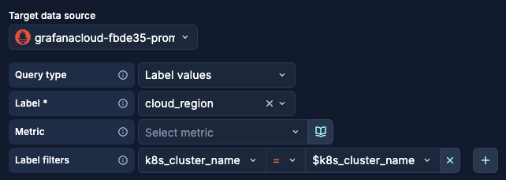
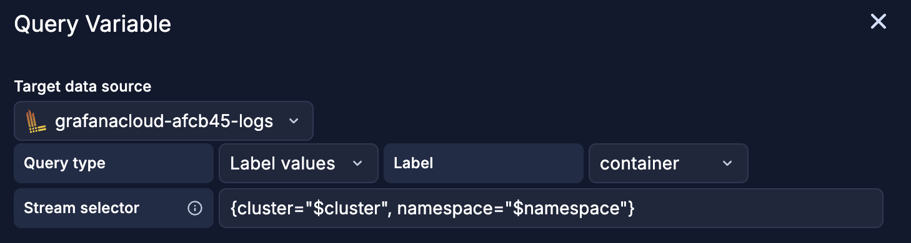
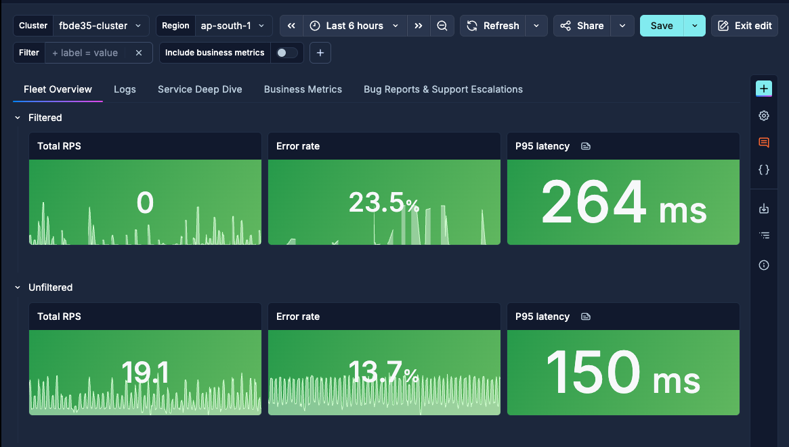
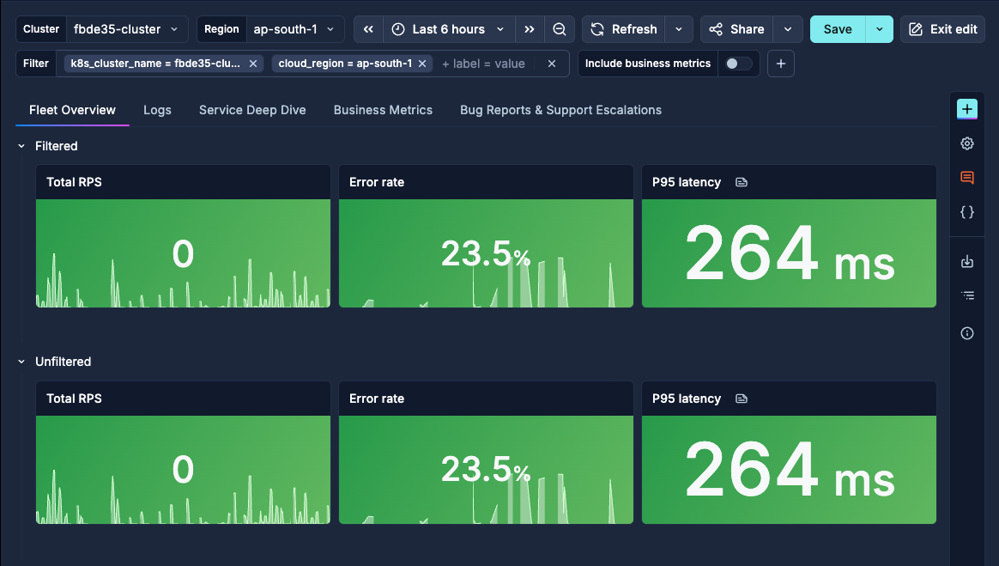
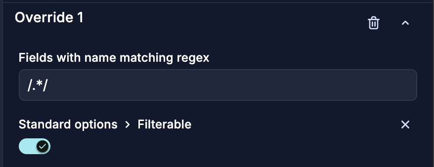
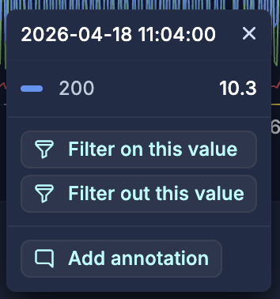
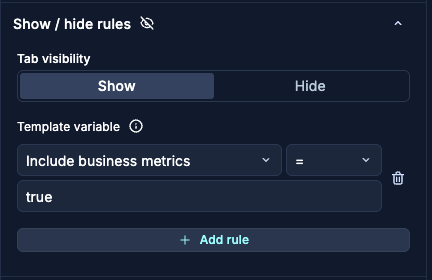
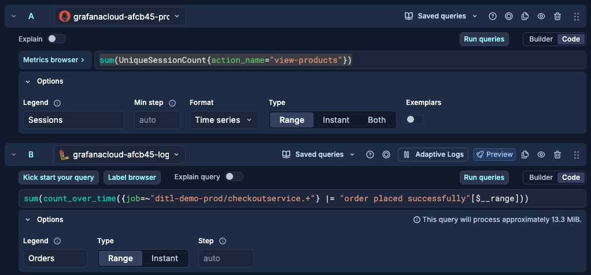
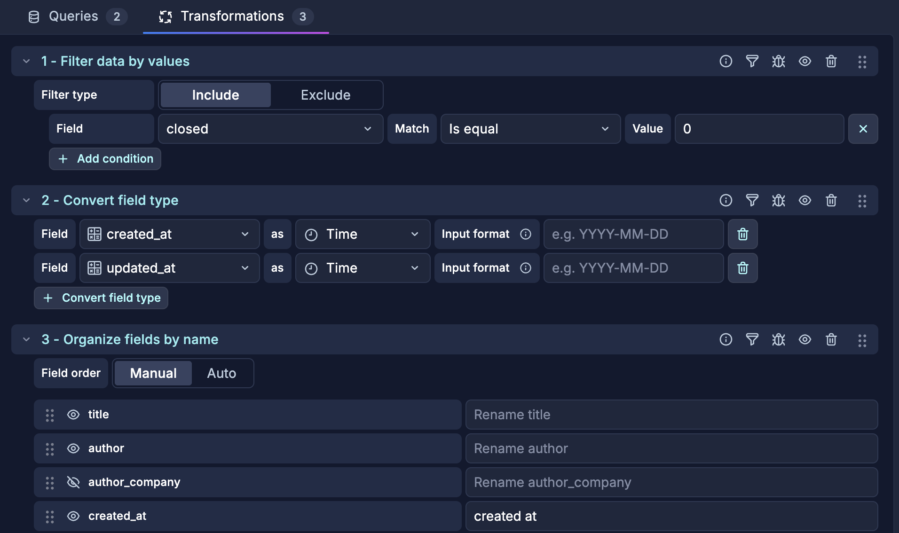
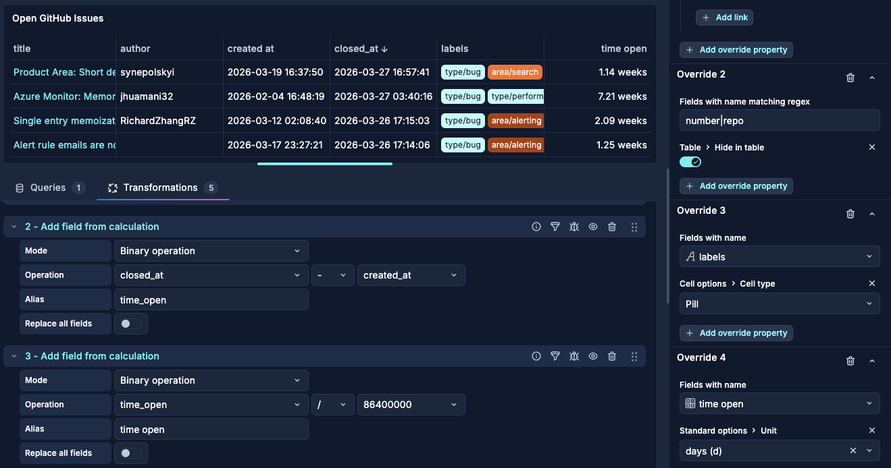

# GrafanaCON 2026 — Advanced Dashboarding Lab: Exercises

> You work for **Grot Plushies**, an e-commerce platform selling super cute Grot plushies. Your job: build a many-in-one dashboard for SREs, EMs, PMs and engineers to visualise **system health** (services, database, logs), **business impact** (orders and revenue) and **project management** (open issues, bug reports, customer support escalations) — all in a single page.

**The platform runs four main services:**

- **Frontend** : the user-facing storefront
- **CartService** : manages shopping carts
- **PaymentService** : processes payments
- **ProductCatalogService** : serves product listings (backed by Postgres)

**Data sources available in your instance:**

- `grafanacloud-fbde35-prom` — Prometheus (span metrics, SLO metrics, Postgres metrics)
- `grafanacloud-fbde35-logs` — Loki (service logs, feature flag events)

---

## Table of Contents


| #   | Task                                                                                                   | Features                                                      | Solution                                                  |
| --- | ------------------------------------------------------------------------------------------------------ | ------------------------------------------------------------- | --------------------------------------------------------- |
| 1   | [Set Up the Dashboard Layout](#task-1--set-up-the-dashboard-layout)                                    | Tabs, layout groups, auto layout                              | [step1.json](step%20by%20step%20-%20Solutions/step1.json) |
| 2   | [Make the Dashboard Interactive with Variables](#task-2--make-the-dashboard-interactive-with-variables) | Query variables, custom variables, variable chaining          | [step2.json](step%20by%20step%20-%20Solutions/step2.json) |
| 3   | [Filters](#task-3--filters)                                                                            | Filters                                                | [step3.json](step%20by%20step%20-%20Solutions/step3.json) |
| 4   | [Show/Hide Rules](#task-4--showhide-rules)                                                             | Filters, show/hide rules, section-level variables      | [step4.json](step%20by%20step%20-%20Solutions/step4.json) |
| 5   | [Field Overrides](#task-5--field-overrides)                                                             | Field overrides by name, by regex, colour and line style      | [step5.json](step%20by%20step%20-%20Solutions/step5.json) |
| 6   | [Data Links](#task-6--data-links)                                                                      | Field data links, dynamic link variables                      | [step6.json](step%20by%20step%20-%20Solutions/step6.json) |
| 7   | [Transformations](#task-7--transformations)                                                             | Transformations — filter, organise, calculate, convert        | [step7.json](step%20by%20step%20-%20Solutions/step7.json) |
| 8   | [SQL Expressions](#task-8--sql-expressions)                                                            | SQL Expressions, cross-query JOINs                            | [step8.json](step%20by%20step%20-%20Solutions/step8.json) |


---

## Task 1 — Set Up the Dashboard Layout

**Goal:** Create the structural skeleton of the dashboard: four tabs, a few basic panels, and an auto-grid layout.

**Features practised:** Tabs, layout groups, auto layout

<details>
<summary>Steps</summary>

1. **Create a new dashboard**
  - Click **Dashboards → New → New dashboard**.
  - [*alt*] or use the `+` button in the top nav bar
2. **Add your first tab — "Fleet Overview"**
  - In the side toolbar, click **Add** → Group layout > **Group into tabs**.
  - Name it **Fleet Overview**.
3. **Add three more tabs**
  - Click the **+ New tab** button to the right of the existing tab.
  - Name them:
    - **Logs**
    - **Service Deep Dive**
    - **Business Metrics**
4. **Add starter panels to Fleet Overview**
  - On the **Fleet Overview** tab
  - Click **+ Add panel**
  - Set Title: **Total RPS**.
  - Click **Configure**
    - Use **Total RPS** saved query or enter it manually
    - Data source: `grafanacloud-<...>-prom`
    - Query A — Total RPS across all services:
      ```promql
      sum(rate(traces_spanmetrics_calls_total{k8s_namespace_name="ditl-demo-prod"}[$__rate_interval]))
      ```
    - Set visualization to **Stat**. 
      - _To set a panel option you can either scroll the right pane to find it or use the magnifying glass icon at the top right to search for it_
      - Calculation **Mean** 
      - Unit **requests/sec**
  - Repeat for **Error rate**:
    - Title: **Error Rate**.
    - Use **Error rate** saved query or enter it manually
    - Query:
      ```promql
      sum(rate(traces_spanmetrics_calls_total{k8s_namespace_name="ditl-demo-prod", status_code="STATUS_CODE_ERROR"}[$__rate_interval]))
      /
      sum(rate(traces_spanmetrics_calls_total{k8s_namespace_name="ditl-demo-prod"}[$__rate_interval]))
      ```
    - Visualisation **Stat**. 
      - Calculation **Mean** 
      - Unit: `Percent (0.0-1.0)`.
  - Repeat for **P95 Latency** panel:
    - Use **Error rate** saved query or enter it manually
    ```promql
    histogram_quantile(0.95,
      sum by (le) (
        rate(traces_spanmetrics_latency_bucket{}[$__rate_interval])
      )
    )
    ```
  - Visualization to **Stat**.
    - Calculation **Mean** 
    - Unit to **seconds (s))**
5. **Enable auto layout**
  - With the Overview tab selected, change the **Layout** options in the panel-editing sidebar.
    - Choose **Auto layout**. Watch your panels snap into an evenly distributed row.
  - *Pro tip*: because stat panels do no need to be huge, use a `narrow` width and `short` height to make sure all 3 fit in one row!
6. **Add a panel to Logs**
  - On the **Logs** tab
  - Click **+ Add panel**
  - Click **Configure**
    - Data source: `grafanacloud-<...>-logs`
    - Use **Logs** saved query or enter it manually
    - Query A :
      ```logql
      {namespace="ditl-demo-prod"}
      ```
    - Set line limit as `100` in query options
    - Set visualization to **Logs**. Title: **Most recent logs**.
7. **Enable auto layout for Logs too**
8. **Save the dashboard** as **Grot Plushies Monitoring Dashboard**.

> **Checkpoint:** You should have a saved dashboard with 4 tabs. The Fleet Overview tab has 3 panels in an auto layout. The Logs tab has 1 panel filling all the space.

</details>


---

## Task 2 — Make the Dashboard Interactive with Variables

**Goal:** Add template variables so every panel can be filtered by cluster, namespace, and service by your viewers.

**Features practised:** Query variables, custom variables, variable chaining

<details>
<summary>Steps</summary>

_To add a dashboard level variable, click the **Add new element** button → Dashboard controls > **Variable** → select a type for it._

1. **Add the `show_business_metrics` variable (toggle)**
   - **Type:** Switch
   - **Name:** `show_business_metrics`
   - **Label:** Display business metrics
   - **Values:** `true,false`

2. **Add the `k8s_cluster_name` query variable**
   - In the **Fleet Overview** tab
   - **Type:** Query
   - **Name:** `k8s_cluster_name`. 
   - **Label:** `Cluster`. 
   - Click **Open variable editor**
   
   - Click **Preview** to make sure you see `fbde35-cluster` then **Close**.

3. **Add the `cloud_region` variable**
   - In the **Fleet Overview** tab
   - **Type:** Query
   - **Name:** `cloud_region`. 
   - **Label:** `Region`. 
   - Click **Open variable editor**
   
   - Click **Preview** to make sure you see `ap-south-1`, `eu-west-1` and `us-east-2` then **Close**.

_To add a section level variable, select the section (row/tab), in its side pane, click the Variables > **Add variable** button → select a type for it._

4. **Add the `service` variable**
   - In the **Logs** tab
   - **Type:** Query
   - **Name:** `service`.
   - **Label:** `Services`. 
  
   - **Stream selector:** `{cluster="$k8s_cluster_name"}`
   - Click **Preview** then **Close**.
   - **Multi-value:** On
  


6. **Wire up your panels**
  - In the **Fleet Overview** tab:
    - Click the **Group panels > Group into a row** button to group all 3 panels into a **row** and call it **Unfiltered**
      - ⚠️ _We will use that row later on_
    - Duplicate the row (select the row and in the side pane use the copy/duplicate button), call the copy **Filtered**
    - Edit all 3 queries to add the filter. 
      - You can replace your queries with the corresponding filtered **saved query** (do not forget to map the correct template variables if needed!), 
      - or update them manually with:
      ```promql
      cloud_region="${cloud_region}",k8s_cluster_name="${k8s_cluster_name}"
      ```
  - In the **Logs** tab, logs panel:
    - Replace the logs query with (either manually or using a **saved query**):
      ```logql
      {namespace="ditl-demo-prod", container="$service"}
      ```
    - Notice how the logs get filtered
    - In the panel repeat options
      - select **service** variable
    - Rename the panel **Most recent logs - $service**

7. **Test the variables**
  - Use the dropdowns at the top to change `Cluster`, and `Region`.
    - Verify the panels in the **Filtered** row of the Fleet overview tab update accordingly. 
    - Notice how the panels in the **Unfiltered** row do not
  - In the **Logs** tab, select multiple `Services` in the template variable 
    - Notice how the panel repeats itself
8. **Save** the dashboard.

> **Checkpoint:** Your dashboard has 3 variables in the top bar, 1 variable under the **Logs* tab. Changing cluster or region filters all three stat panels on Tab 1 and changing service repeats the logs panel in Logs tab.

</details>


---

## Task 3 — Filters 
**Goal:** Replace hard-coded query variables with filters

**Features practised:** Filters


### Part A — Replace query variables with filters

<details>
<summary>Steps</summary>

1. **Add a filter**
  - Click the **Add new element** button → Dashboard controls > **Filter and Group by** 
  - **Name:** Filter
  - **Data source:** `grafanacloud-fbde35-prom`

2. In the **Fleet Overview** tab:
  - Set up the new filter variable to reflect what you selected in the query variables.
    - Notice how now the panels in both **Filtered** and **Unfiltered** rows now show the same thing.

  | No filter selected    | Filters to match variables |
  | -------- | ------- |
  |   |     |

3. **Use filters only**
  - Remove the 2 query variables for cluster & region
  - Delete the **Filtered** row that references them
  - To tidy up, you can also use **Ungroup rows** to remove the single row in your tab.

> **Checkpoint:** Filters apply dashboard-wide and replace query variables. 

</details>

### Part B — Group by and Panel to Panel filtering

<details>
<summary>Steps</summary>

1. **Create a new time series panel in the Service Deep Dive tab**
  - Navigate to the **Service Deep Dive** tab.
  - Click **+ Add panel**.
  - Title: **Requests**.
  - Click **Configure**
    - Use the **Request** saved query or enter the query manually:
      ```promql
      sum(rate(traces_spanmetrics_calls_total{}[$__rate_interval]))
      ```
    - Visualization: **Time series**.

2. **Try out the Group By option**
  - In the top-right corner of the panel, notice the **Group by** dropdown 
    - _Troubleshooting: if you do not have it, chances are you did not enabled group by on Filter_ 
  - Select `http_status_code` — see how the panel now splits into one series per status code and the Filter updates.

3. **Enable filterable fields via an override**
  - Open the **Show only overrides** section in the panel editor.
  - Click **Add field override** → **Fields with name matching regex**: `/.*/`
  - Add property: **Standard options > Filterable** → enable it.

  

4. **Use panel-to-panel filtering**
  - Go Back to the dashboard
  - Click on a series — notice you now get the option to **Filter for** or **Filter out** that specific value.

  

5. **Filter out 200 status codes**
  - Click on the `200` series and select **Filter out**.
  - Notice how the filter is now applied **dashboard wide** — all panels using that prometheus data source will now exclude `200` return codes.

> **Checkpoint:** In the Service Deep Dive tab, you have a time series panel with group-by support and panel-to-panel filtering enabled. Clicking a series lets you filter on or out specific values, and those filters propagate across the entire dashboard.

</details>

---

## Task 4 — Show/Hide Rules
**Goal:** Add show/hide rules, and reorganise variables by section.

**Features practised:** Show/hide rules, section-level variables

### Part A : Toggle Busniess metrics tab on and off with switch variable

<details>
<summary>Steps</summary>

1. **Add a show/hide rule for the Business Metrics tab**
  - Select the **Business Metrics** tab.
  - Add a show/hide rule:
    - **Tab visibility:** `Show`
    - **Variable:** `Display business metrics`
    - **Operator:** `equals`
    - **Value:** `true`
  - The entire tab is now hidden unless the switch variable is toggled on.



2. **Test your rules**
  - Toggle `include_business` on → the Business Metrics tab should show.
  - Toggle `include_business` off → the Business Metrics tab should hide.


> **Checkpoint:** A business metrics tab is hidden unless we toggle a switch variable.

</details>

### Challenges

You're done early? 

Try adding another rule to the dashboard: only show a new **Database** tab if your viewer selected a `productcatalog` in the filter.
You can add a panel using the saved query **Fetch data (SELECT)** to make it more real :).

<details>
<summary>View solution</summary>


</details>

You can also set up the **Logs** tab to only show if looking at a time range under 7 days.


---

## Task 5 — Field Overrides

**Goal:** Make panels visually self-explanatory by styling individual series differently.

**Features practised:** Field overrides by name, by regex, colour and line style

There are 2 exercises in that section, you can do both or pick one of them.


### Part A — Orders vs Sessions (Business Metrics)
<details>
<summary>Steps</summary>
1. **Navigate to Tab 3 — Business Metrics**

2. **Create the panel**
   - Add a new panel. Title: **Orders vs Sessions**.
   - Datasource: **Mixed**
   - _Note: there are saved queries that you can use instead of the manual steps._
   - **Query A — Orders:** Loki
     ```logql
     sum(count_over_time({job=~"ditl-demo-prod/checkoutservice.+"} |= "order placed successfully"[$__range]))
     ```
     - Options Legend: `Orders`
   - **Query B — Sessions:** Prometheus
     ```promql
     sum(UniqueSessionCount{action_name="view-products"})
     ```
     - Options Legend: `Sessions`
   - Visualization: **Time series**.

   

3. **Add field overrides to differentiate the two series**


  - Go to the **Overrides** section in the panel editor.
    - _pro tip: you can click the **Show only overrides** button to get there faster_
  - **Override 1 — Orders:**
    - **Match:** Fields with name **Orders**
    - **Color scheme:** Single color : Green
  - **Override 2 — Sessions:**
    - **Match:** Fields with name **Sessions**
    - **Color scheme:** Single color : Purple 
    - **Line style:** Dots
    - **Axis placement:** Right Y

4. **Verify**
  - You should see two series on the same chart: Orders as a solid green line on the left axis, Sessions as a dashed purple line on the right axis.
  - The dual-axis layout lets you compare trends even when the absolute values are on different scales.
</details>


### Part B — HTTP status code
<details>
<summary>Steps</summary>
1. On the **Service Deep Dive** tab, **Request** panel`
  - Make sure you group by `http_status_code`

2. Open the **Overrides** section in the panel options.
3. **Override 1 — make 2xx green:**
  - Click **Add field override** → **Fields with name matching regex**: `2[0-9][0-9]`
  - Add property: **Standard options > Color scheme** → **Single color** → Green.
4. **Override 2 — make 4xx orange:**
  - Click **Add field override** → **Fields with name matching regex**: `4[0-9][0-9]`
  - Add property: **Standard options > Color scheme** → **Single color** → Orange.
5. **Override 3 — make 5xx red:**
  - Click **Add field override** → **Fields with name matching regex**: `5[0-9][0-9]`
  - Add property: **Standard options > Color scheme** → **Single color** → Red.
6. **Save** the dashboard.

> **Checkpoint:** Confirm that 2xx lines are green, 4xx are orange and 5xx are red in the visualization.

</details>


---

## Task 6 — Data Links

**Goal:** Wire panels so clicking a data point takes you to the right context instantly — starting with a GitHub Issues tracker built from a CSV.

**Features practised:** Field data links, dynamic link variables
We want to visualise - and correlate - bug reports & customer support escalation from the same place. Let's add that data in!

<details>
<summary>Steps</summary>

1. **Create a "Github Stats" tab**
   - Click the **Add tab** button.
   - Name it **Github Stats**.

2. **Add a Table panel**
   - On the **Github Stats** tab, click **+ Add panel** 
   - Title: **Open GitHub Issues**.

3. **Load the CSV test data**
   - Click **Configure** on the panel
   - Data source: **TestData**.
   - Scenario: **CSV Content**.
   - Paste the contents of [`./resources/github_issues.csv`](./resources/github_issues.csv) into the CSV field. It contains columns:
     - `title`, `author`, `author_company`, `repo`, `number`, `closed`, `created_at`, `closed_at`, `updated_at`, `labels`, `assignees`
   - Select **Table** as visualisation

4. **Add a data link to the issue title**
   - Open the **Overrides** section.
   - Add a new override:
     - Match: **Fields with name** `title`
     - Add property: **Data links** , expand then click **+ Add link**
       - **Title:** `Open on GitHub`
       - **URL:** `https://github.com/${__data.fields.repo}/issues/${__data.fields.number}`
       - Enable **Open in new tab**

5. **Hide the number/repo columns on the table**
   - In the **Overrides** section
   - Add a new override:
     - Match: **Fields with name matching regex** `number|repo`
     - Enable **Table > Hide in table**

6. **Test the data link**
   - In view mode, hover over any issue title — you should see the link tooltip.
   - Click it → the corresponding GitHub issue opens in a new tab.

7. Change the **GitHub Stats** layout to Auto so the panel fills the space then **Save** the dashboard.

> **Checkpoint:** The GitHub Stats tab has a table of open GitHub issues. The `number` and `repo` columns are hidden. Clicking any issue title opens the real GitHub issue in a new tab.

## Bonus task
You're done early? 
Make the labels display as pills.

<details>
<summary>View solution</summary>


</details>

</details>


---

## Task 7 — Transformations

**Goal:** Use transformations to improve on the Github issues table

**Features practised:** Transformations - filter, organise, calculate, convert

> **Important:** Transformations are applied *before* overrides. If you use a transformation to remove a field (e.g. via **Organise fields**), any data link that references that field with `${__data.fields.<name>}` will resolve to an empty string — because the field no longer exists by the time overrides run. If you need a field available for a data link but don't want it visible in the table, use the **Hide in table** override (as we did in Task 6, step 5) instead of removing it with a transformation.

<details>
<summary>Steps</summary>

1. **Filter data by value**
  - Only show issues that are not closed (_hint_: closed is a tinyint type, use `0` or `1` for comparison)

2. **Convert field type**
  - Make times readable by converting them to `Time`

3. **Organise fields by name**
  - Hide `author_company`, `closed`, `closed_at` and `assignees`
  - Rename columns to be easier to read (remove underscores)




---

### Bonus task / Challenge
You're done early? 
 - duplicate the panels and name the copy **Closed bugs**
 - filter the table for bugs only
<details>
<summary>View solution</summary>


</details>

 - switch to only showing closed issues and calculate the time the issue was open for
<details>
<summary>View solution</summary>

Do not forget an override to change the unit to **days**



</details>

_When you are done, submit your answers in <a href="https://docs.google.com/forms/d/e/1FAIpQLSfO-wiPqML91LuNJffZ5VIfH7GbwbNodoyk5vAPIMt3V6rWiA/viewform" target="_blank">this form</a> - You'll get a prize if you are the first to respond!!_
_**Note:** You can submit the form several time. Feel free to answer the first question as soon as you can and spend time thinking about the second one afterwards._

</details>


---

## Task 8 — SQL Expressions

**Goal:** Use SQL Expressions to combine data from multiple queries into a single table — no extra transformations needed.

**Features practised:** Transformations, SQL Expressions, cross-query JOINs


### Part A — Replace Task 7 transformations with SQL
<details>
<summary>Steps</summary>
Duplicate the panel from Task 7 and replace all transformations with a single SQL expression.

- Remove all transformations (or hide them with eye icon) 
- Add a new query **B** → type **SQL Expression**
- Hide query **A** from the visualization (eye icon)
- Enter the following SQL:

```sql
SELECT
  title,
  author,
  repo,
  number,
  DATE_FORMAT(from_unixtime(created_at / 1000), '%Y-%m-%d %H:%i:%s') AS `created at`,
  labels
FROM A
WHERE closed = false
```

> **Checkpoint:** The table shows only open issues with a human-readable date, same as before — no transformation steps needed.

</details>

---

### Part B — JOIN: Bug vs Feature ratio per repo
<details>
<summary>Steps</summary>
**Goal:** Use a single SQL expression to compare bug, feature requests and customer escalations volume across repos.

1. **Add a new panel on the GitHub Stats tab**
   - Title: **Type of issues by Repository**
   - Visualization: **Table**
   - Data source: **TestData** → Scenario: **CSV Content** → paste the contents of [`./resources/github_issues.csv`](./resources/github_issues.csv)

2. **Add a SQL Expression** (Query B)
   - Hide query A from the visualization
   - Enter:

```sql
SELECT
  repo as repository,
  COUNT(CASE WHEN labels LIKE '%bug%' THEN 1 ELSE null END)/COUNT(*) as `Bugs %`,
  COUNT(CASE WHEN labels LIKE '%feature-request%' THEN 1 ELSE null END)/COUNT(*) as `Feature requests %`,
  COUNT(CASE WHEN labels LIKE '%customer-support%' THEN 1 ELSE null END)/COUNT(*) as `Support escalations %`
FROM A 
WHERE 
  closed = false
GROUP BY repo
```

3. **Add a unit override on anything with `%`**
   - Match: **Fields matching regex** `/%/`
   - Add property: **Standard options > Unit** → **Percent (0-1)**

4. **Save** the panel.

> **Checkpoint:** The table shows each repo with its raw bug and feature request counts, plus a percentage showing what share of labelled issues are bugs. `grafana/scenes` and `grafana/grafana` should both appear.

</details>

---

### Challenge: Bug hunter leaderboard

You're done early? Complete this challenge!

<details>
<summary>Steps</summary>
Grot plushies is shipping a new, improved version of their payment service. To make sure evrything is working as expected, you are running a bug bash: every employee is encouraged to try things out and report bugs. 
You want to give a public shoutout to the top bug hunters at the next group meeting.

_When you are done, submit your answers in <a href="https://docs.google.com/forms/d/e/1FAIpQLSfO-wiPqML91LuNJffZ5VIfH7GbwbNodoyk5vAPIMt3V6rWiA/viewform" target="_blank">this form</a> - You'll get a prize if you are the first to respond!!_
_**Note:** You can submit the form several time. Feel free to answer the first question as soon as you can and spend time thinking about the second one afterwards._

**Goal:** Use `RANK()` and `SUM() OVER ()` to build a ranked leaderboard for the bug bash last week (**April 13rd to April 17th**)
  - Who are the top 3 bug hunters?
  - What percentage of the repo have they contributed to?

<details>
<summary>View solution</summary>

1. **Add a new panel on the GitHub Stats tab**
   - Title: **Top Issue Reporters**
   - Visualization: **Table**
   - Data source: **TestData** → Scenario: **CSV Content** → paste the contents of [`./resources/github_issues.csv`](./resources/github_issues.csv)

2. **Add a SQL Expression** (Query B), hide query A:

```sql
SELECT
  RANK() OVER (ORDER BY bugs_reported DESC) AS `rank`,
  author,
  bugs_reported,
  ROUND(bugs_reported * 100.0 / SUM(bugs_reported) OVER (), 1) AS percentage
FROM (
  SELECT author, COUNT(*) AS bugs_reported
  FROM A
  WHERE 
    labels LIKE '%bug%'
    AND repo = 'grot-plushies/payment-service'
    AND author IS NOT NULL
    AND created_at <= $__to AND created_at >= $__from
  GROUP BY author
) sub
ORDER BY bugs_reported DESC
LIMIT 20
```

**_Note_**: The use of `$__to` and `$__from` make sure the query filters by the time selected in the time picker. You could also hard code the dates there instead

3. **Add overrides to style the leaderboard**
   - **`rank` column:** Cell type → **Colored text**, thresholds: gold (212,175,55) < 2, silver (192,192,192) 2, bronze (205,127,50) 3, transparent otherwise. 
     - Pro tip: enable **Apply to entire row**
   - **`percentage` column:** Unit → **Percent (0–100)**

4. **Save** the dashboard.

</details>


> **Checkpoint:** The leaderboard shows the top 10 contributors ranked by open issues filed, with each person's share of the total. `RANK()` and `SUM() OVER ()` are doing work that would require multiple transformation steps — and even then couldn't produce a true rank column.

</details>


## Congratulations!

You've built a single, many-in-one dashboard that covers system health, business impact and project management — all in one place. Along the way you used:

- **Tabs and auto layout** to organise content by audience
- **Template variables** and **filters** to scope every panel dynamically
- **Repeat groups** to generate per-service views automatically
- **Show/hide rules** to surface the right panels at the right time
- **Section-level variables** to keep each tab focused
- **Field overrides** to make data visually self-explanatory
- **Data links** to wire investigation paths between panels
- **Saved queries** to standardise and reuse queries
- **SQL Expressions** to combine and reshape data without extra transformations

**One dashboard. Every persona. Every scenario.**